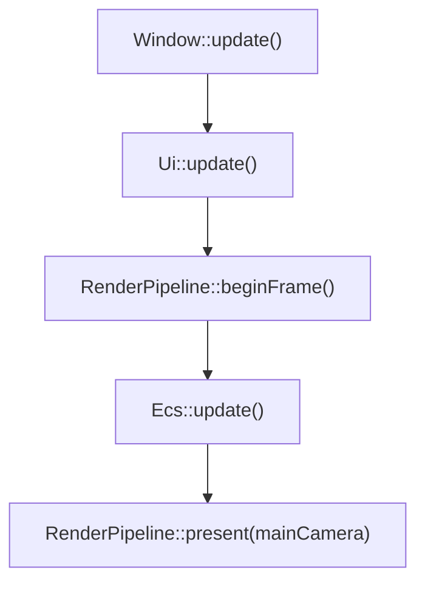

Final engine code, bringing together all subsystems.

# Frame Process

## `Window::update()`
Update window, read input, handle resize.
## `UI::update()`
Draw interface and handle input.
## `RenderPipeline::beginFrame()`
Prepare for rendering, update state to match window if changed.
## `Ecs::update()`
Main update process.
## `RenderPipeline::present(mainCamera)`
Present the main camera to the window.